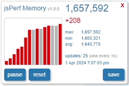
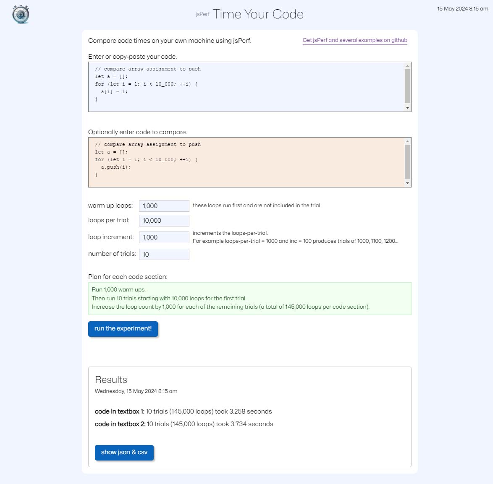

  
<b>simple-to-use JavaScript timer and memory module</b>
 

jsPerf is a simple-to-use JavaScript module that measures memory and speed.
It works both in node and on the web and comes with several examples. 
jsPerf also includes a real-time memory widget so you can observe overall memory behavior.
 

<table>
  <tr>
    <td valign="top">
      <b>Example Memory Example Results</b>
       
<pre>baseline memory used:.....................  4,737,080
memory after creating a 10M item array:... 84,732,544
memory after removing a 10M item array:...  4,732,400</pre>
       
      <b>jsPerf Memory Widget Example</b> 
      
        
      <a href="./src/modules/jsPerfWidget/examples/jsPerfWidgetExample.html">memory widget demo</a>
    </td>
    <td valign="top">
      <b>jsPerf Timer Example Results</b>
       
      <pre>time to run for loop 100,000,000 times: 0.094 seconds   </pre>
       
      <b>Time Your Code Tool</b> 
      
        
      <a href="./src/modules/jsPerf/examples/webExamples/timeYourCode/timeYourCode.html">time your code tool</a>
    </td>
  </tr>
</table>
 
<b>jsPerf API</b>
<table>
  <tr><td>getName()</td><td>returns the module's name (jsPerf)</td></tr>
  <tr><td>getVersion()</td><td>returns the module's version</td></tr>
  <tr><td>supportsMemory()</td><td>returns true if memory functions are available</td></tr>
  <tr><td>gcIsAvailable()</td><td>returns true if jsPerf can call the garbage collector</td></tr>
  <tr><td>startTime()</td><td>start the timer, returning start time</td></tr>
  <tr><td>getTime(startTime)</td><td>get the performance time in seconds or the absolute time if startTime is missing</td></tr>
  <tr><td>async getMemory()</td><td>get the heap memory used</td></tr>
</table>
 

<a href="https://rg3h.github.io/jsPerf/"><b>learn more</b></a>
